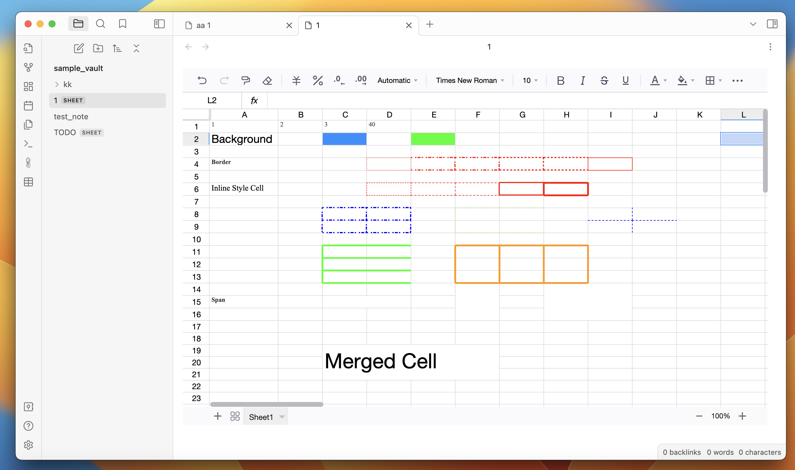
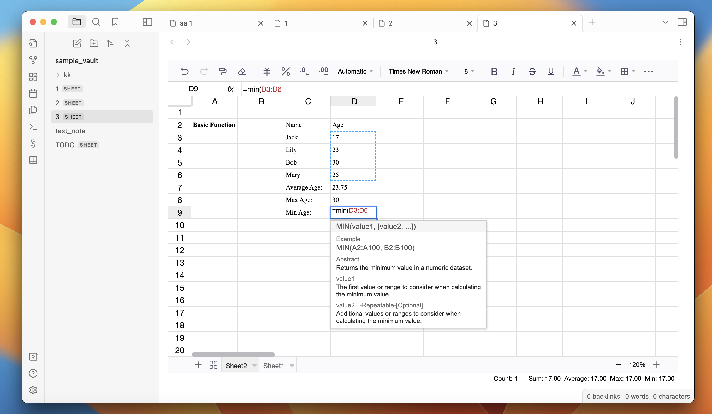
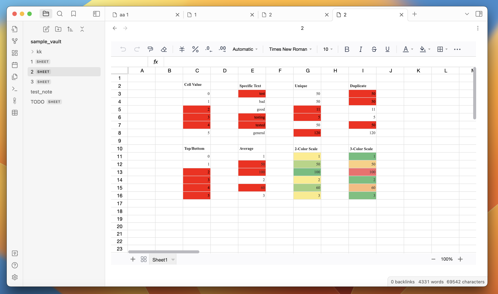
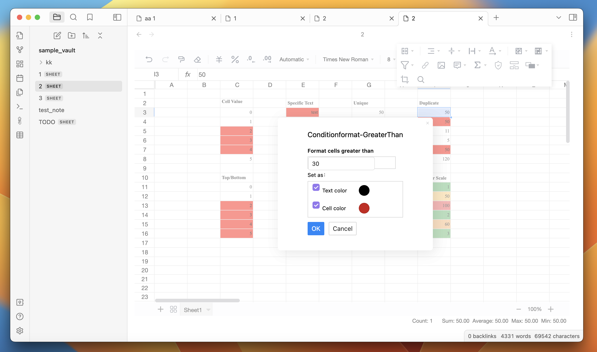
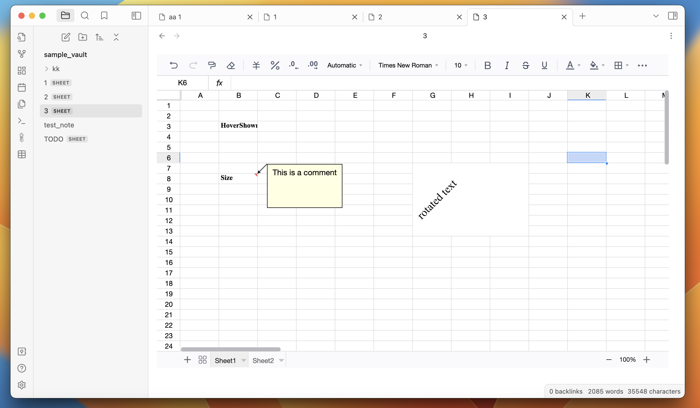

# Obsidian Spreadsheets Plugin

This plugin gives you all the features of a standard spreadsheets tool in obsidian. You can build powerful spreadsheets within obsidian. 

This plugin is based on FortuneSheet, which is based on Luckysheet. 

### Features: 

- Rich text formatting - change fonts, size, colors, borders, cell color, line-wrapping, etc

- Formulas - several build in formulas 

- Filter and sort 

- Cells - merge cells, resize cells, drag cells 

  

### Screenshots: 

### 

